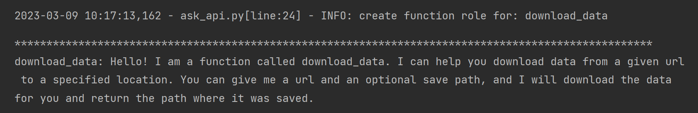
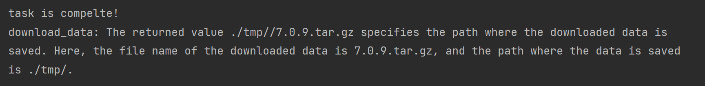

# ask-api

#### Description
ask-api is a python framework, based on the llm models, which can help you to understand your python code by asking questions, and provide the following capabilities:
- Ask questions to understand the function.
- Execute the function directly by natural language.
- using natural language to describe the exceptions and errors.
- Other free dialogue with the function.

#### Installation (to be improved)
```shell
# pip install ask-api
```

#### Development plan (in progress)

- [x] Based on openai's chatgpt-api, support asking questions about python functions to understand the function.
- [X] Support Chinese and English prompts.
- [ ] Install via pip.
- [ ] Support custom prompts.
- [X] Support executing functions by natural language commands.
- [ ] Support other llm models or apis as the underlying algorithm support


#### Example(continuously improving)

- More details, please refer to [en_example](./examples/en_askapi_example.ipynb)
- Example function
```python
# example function, given url，download the data and return the path
import wget
import os
BASE_PATH = "./tmp/"


def download_data(url, save_path = None) -> str:
    """download data from url
    Args:
        url (_type_): the url of data
        save_path (_type_): the path to save data
    Returns:
        str: the path of data
    """
    if save_path is None:
        save_path = wget.detect_filename(url)

    if not os.path.exists(BASE_PATH):
        os.makedirs(BASE_PATH)

    save_path = f'{BASE_PATH}/{save_path}'
    wget.download(url, save_path)
    return save_path
```

- Use ask-api to ask questions about the function and understand the function
```python
# use ask_func to ask the function's description
session = ask_func(download_data, message="", mode='desc')

print("*" * 100)
print(session.get_current())
```


- use natural language to execute the function
```python
session = ask_func(download_data, message="please download this data for me：https://github.com/redis/redis/archive/7.0.9.tar.gz", mode="execute")

print(session.get_current())
```


- get result of the function task via wait_task
```python
# get result of the function task
from ask_api.util.askapi_asyn import wait_task

task = session.get_current().get_task()
if task is None:
    print("task is complete!")
    print(session.get_current())
else:
    print("task is running")
    result = wait_task(task)
    print(result)
```



- handling invalid message
```python
# handling invalid message
session = ask_func(download_data, message="please download this data for me", mode="execute")

print(session.get_current())
```


- handling task exception
```python
# handling task exception
session = ask_func(download_data, message="please download this data for me：xxx.xxx", mode="execute")

print("*" * 100)
print(session.get_current())
print("*" * 100)
task = session.get_current().get_task()
if task is None:
    print("task is complete!")
    print(session.get_current())
else:
    print("task is running")
    result = wait_task(task)
    print(result)
```


- free dialogue with the function(TODO)