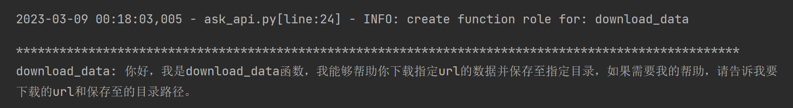
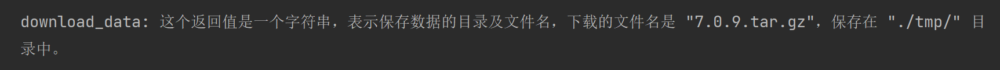
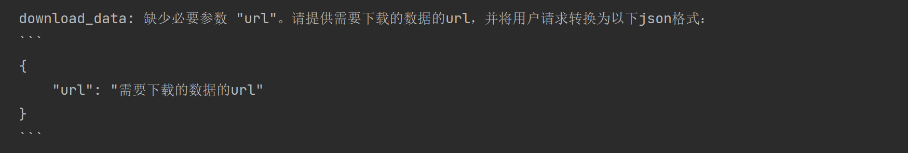
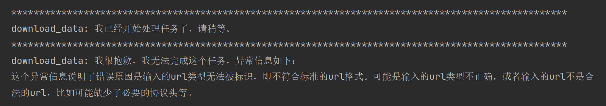

# ask-api

#### 说明
ask-api 是一个python框架，借助LLM(目前支持chatgpt-api)模型的代码理解能力，让你能够与你的python代码对话，提供包括但不限于如下的能力： 
- 通过提问了解函数的用途。
- 直接通过自然语言来执行函数。
- 将操作过程中的各种异常信息，通过自然语言的方式告知用户。
- 与函数进行其他自由对话。

#### 安装(待完善)
```shell
```

#### 开发计划(进行中)

- [x] 基于openai的chatgpt-api，支持对python函数进行提问，了解函数的用途。
- [X] 支持中文以及英文两种类型的prompt。
- [ ] 支持自定义的prompt。
- [X] 支持通过自然语言命令来执行函数。
- [ ] 支持其他LLM模型或api作为底层算法支持

#### 示例(持续完善中)

- 更多细节，请参考[中文示例](./examples/cn_askapi_example.ipynb)
- 示例函数
```python
# 示例函数，给定url，下载数据并保存至指定目录
import wget
import os
BASE_PATH = "./tmp/"


def download_data(url, save_path = None) -> str:
    """下载数据并保存至指定目录
    Args:
        url (_type_): 需要下载的数据的url
        save_path (_type_): 保存数据的目录
    Returns:
        str: 保存数据的目录
    """
    if save_path is None:
        save_path = wget.detect_filename(url)

    if not os.path.exists(BASE_PATH):
        os.makedirs(BASE_PATH)

    save_path = f'{BASE_PATH}/{save_path}'
    wget.download(url, save_path)
    return save_path
```

- 利用ask-api对函数进行提问，了解函数的用途
```python
from ask_api.ask_api import ask_func

# 获取函数的功能说明
session = ask_func(download_data, message="", mode='desc')

print("*" * 100)
print(session.get_current())
```


- 利用ask-api，直接通过自然语言来执行函数
```python
# 使用自然语言调用函数
session = ask_func(download_data, message="请帮我下载这个数据：https://github.com/redis/redis/archive/7.0.9.tar.gz", mode="execute")

print(session.get_current())
```


- 函数执行为异步执行，可以通过wait_task方法等待函数执行完成
```python
# get result of the function task
from ask_api.util.askapi_asyn import wait_task

task = session.get_current().get_task()
if task is None:
    print("task is complete!")
    print(session.get_current())
else:
    print("task is running")
    result = wait_task(task)
    print(result)
```


- 异常命令的处理
```python
# 异常指令处理
session = ask_func(download_data, message="请帮我下载", mode="execute")

print(session.get_current())
```


- 函数执行异常的处理
```python
# 任务执行中异常处理
session = ask_func(download_data, message="请帮我下载这个数据：xxx.xxx", mode="execute")

print("*" * 100)
print(session.get_current())
print("*" * 100)
task = session.get_current().get_task()
result_message = wait_task(task)
print(result_message)
```


- 与函数进行其他自由对话(TODO)
